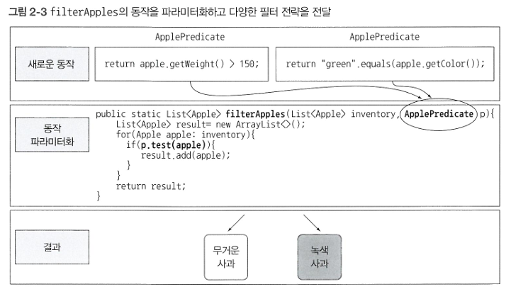
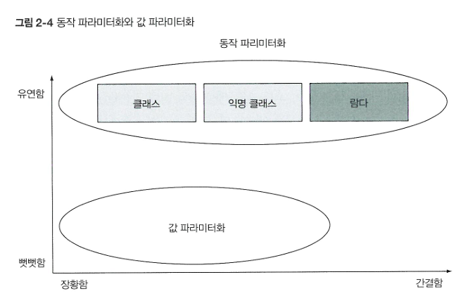

# Ch2. 동작 파라미터화 코드 전달하기
동작 파라미터화란 아직은 어떻게 실행할 것인지 결정하지 않은 코드 블록을 의미한다. 즉, 코드 블럭의 실행은 나중으로 미뤄진다.

코드 블럭에 따라 메서드 동작이 파라미터화 되는 동작 파라미터화를 이용하면 변화하는 요구사항에 효과적으로 대응할 수 있다!


### 첫 번째 시도와 두 번째 시도
색깔과 무게로 각각 필터링하는 구현 코드를 보면, 사과 목록을 검색하고, 각 사과에 필터링 조건을 적용하는 부분의 코드가 대부분 중복된다.


이는 소프트 공학의 DRY(Don't Repeat Yourself: 같은 것을 반복하지 말 것) 원칙을 어기는 것이다.

### 세 번째 시도
이 구현 메서드를 사용하는 방법은 다음과 같다.

```java

List<Apple> greenApples = filterApple(inventory,GREEN,0,true);
List<Apple> heavyWeightApples = filterApple(inventory,null,150,false);

```

위 코드는 true와 false가 무엇을 의미하는지 알 수 없고, 요구사항이 바뀌었을 때에도 유연하게 대응할 수 없다.

### 네 번째 시도: 동작 파라미터화
인터페이스 ApplePredicate가 사과 선택 전략을 캡슐화함으로써 
filterApples 메서드 내부에서 컬렉션을 반복하는 로직과 컬렉션의 각 요소에 적용할 동작을 분리할 수 있다.

```java

List<Apple> greenApples = filterApple(inventory,AppleGreenColorPredicate);
List<Apple> heavyWeightApples = filterApple(inventory,AppleHeavyWeightPredivate);

```
이처럼 컬렉션 탐색 로직과 각 항목에 적용할 동작을 분리할 수 있다는 것이 동작 파라미터화의 강점이다!



### 다섯 번째 시도: 익명 클래스
여러 클래스를 구현해서 인스턴스화 하는 과정은 조금 거추장스럽게 느껴질 수 있다. 
자바는 클래스의 선언과 인스턴스화를 동시에 수행할 수 있도록 익명클래스라는 기법을 제공한다.

```java

List<Apple> redApples = filterApples(inventory,new ApplePredicate(){
    public boolean test(Apple apple){
    return RED.equals(apple.getColor());
    }
});

```

익명 클래스는 여전히 많은 공간을 차지하고 많은 프로그래머가 익숙하지 않다는 점에서 부족함을 느낄 수 있다.
결과적으로 객체를 만들고 명시적으로 새로운 동작을 정의하는 메서드를 구현해야한다는 점은 변하지 않는다.

### 여섯 번째 시도: 람다 표현식 

```java

List<Apple> result = filterApples(inventory, (Apple apple) -> RED.equals(apple.getColor()));

```



### 일곱 번째 시도: 리스트 형식으로 추상화
지금까지 사과를 사용하여 예제를 살펴보았다. 이제는 바나나, 오렌지, 정수, 문자열 등의 리스트에도 필터링을 적용하려고 한다.
리스트의 요소들을 제네릭을 사용하여 추상화해보자!

```java

List<Apple> redApples = filter(inventory, (Apple apple) -> RED.equals(apple.getColor()));
List<Integer> evenNumbers = filter(numbers, (Integer i) -> i%2==0);

```

## 자바 API의 메서드를 파라미터화하기
자바는 동작 파라미터화를 가능하게 하기 위해 Comparator, Runnable, Callable 와 같은 인터페이스를 제공한다.

### Comparator로 정렬하기
변화하는 요구사항에 쉽게 대응할 수 있는 다양한 정렬 동작을 수행하는 코드를 동작 파라미터화로 구현해보자.

다음과 같은 인터페이스를 갖는 java.util.Comparator 객체를 이용해서 sort 동작을 파라미터화 할 수 있다.
```java

public interface Comparator<T> {
    int compare(T o1, T o2);
}

```

람다 표현식을 이용해 요구사항에 맞는 Comparator를 만들어 sort 메서드에 전달하면 된다.
```java

inventory.sort((Apple a1, Apple a2) ->
        a1.getWeight().compareTo(a2.getWeight()));

```

### Runnable로 코드 블록 실행하기
```java

public interface Runnable{
    void run();
}

```

람다 표현식을 이용하여 다음과 같이 Runnable을 구현해 다양한 동작을 스레드로 실행할 수 있다.
```java

Thread t = new Thread(() -> System.out.println("Hello world"));

```

