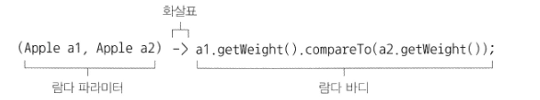
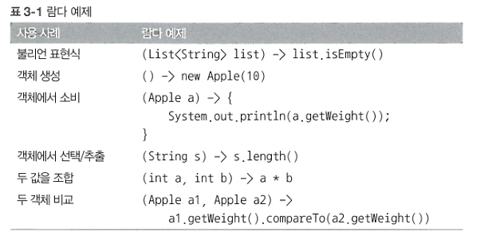
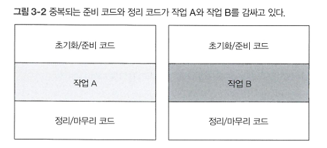
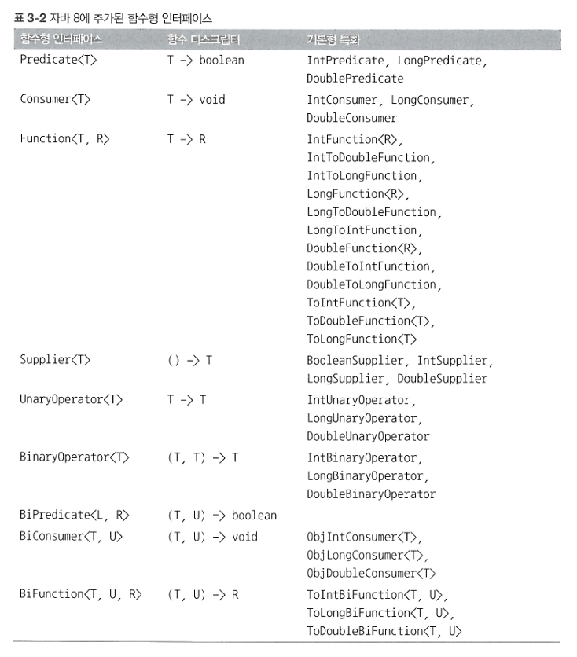
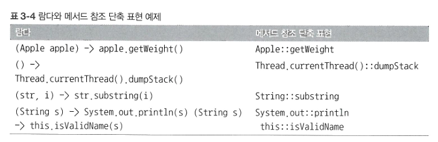
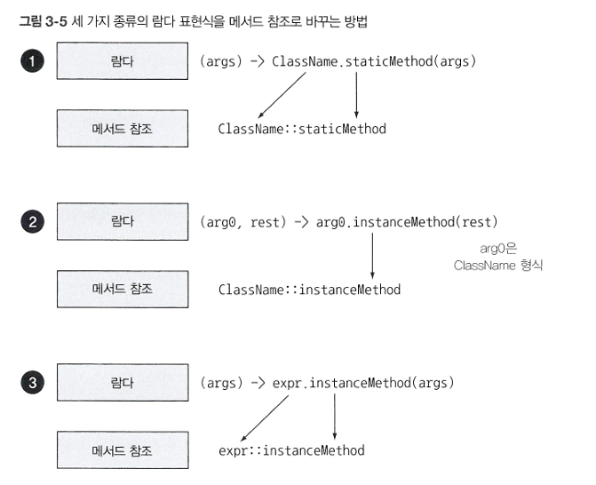

# Ch3. 람다 표현식
이 장에서는 람다 표현식을 어떻게 만드는지, 어떻게 사용하는지, 어떻게 코드를 간결하게 만들 수 있는지 설명한다.
또한 자바8 API에 추가된 중요한 인터페이스와 형식 추론 등의 기능과, 람다 표현식과 함께 위력을 발휘하는 새로운 기능인 메서드 참조를 설명한다.

## Ch3-1. 람다란 무엇인가?
- 익명 \
  보통의 메서드와 달리 이름이 없다.
- 함수 \
  람다는 메서드처럼 특정 클래스에 종속되지 않으므로 함수라고 부른다. 하지만 메서드처럼 파라미터 리스트, 바디, 반환 형식, 가능한 예외 리스트를 포함한다.
- 전달 \
  람다 표현식을 메서드 인수로 전달하거나 변수로 저장할 수 있다.
- 간결성 \
  익명 클래스처럼 많은 자질구레한 코드를 구현할 필요가 없다.

람다는 파라미터, 화살표, 바디로 이루어진다.

** 람다 표현식에는 return이 함축되어 있으므로 return문을 명시적으로 사용하지 않아도 된다.

유효한 람다 표현식은 다음과 같다.


## Ch3-2. 어디에, 어떻게 람다를 사용할까?
### 함수형 인터페이스
함수형 인터페이스는 오직 하나의 추상 메서드만 지정하는 인터페이스다.
따라서, 함수형 인터페이스의 추상 메서드는 하나이므로 람다 표현식의 표현식을 함수형 인터페이스의 인스턴스로 취급할 수 있다!

지금까지의 Predicate, Comparator, Runnable 클래스는 모두 함수형 인터페이스이다.

### 람다 활용 : 실행 어라운드 패턴
람다와 동작 파라미터화로 유연하고 간결한 코드를 구현하는 데 도움을 주는 실용적인 에제를 살펴보자.

실행 어라운드 패턴이란, 실제 자원을 처리하는 코드를 설정과 정리 두 과정이 둘러싸는 형태를 가진 코드를 말한다.

```java

public String processFile() throws IOException{
    //작업 코드
    try (BufferedReader br = new BufferedReader(new FileReader("data.txt"))){
            return br.readLine();
    }    
}

```



1. 동작 파라미터화를 기억하라. \
   위 코드는 파일에서 한 번에 한 줄만 읽을 수 있다. 
   기존의 설정, 정리 과정은 재사용하고 processFile 메서드만 다른 동작을 수행하도록 명령할 수 있다면 좋을 것이다.
   processFile의 동작을 파라미터화하면 된다.
   ```java
   
   String result = processFile((BufferedReader br) -> br.readline() + br.readLine());

    ```
2. 함수형 인터페이스를 이용해서 동작 전달 \
   BufferedReader -> String과 IOException을 던질 수 있는 시그니처와 일치하는 함수형 인터페이스를 만들자.
   ```java
   
   @FunctionalInterface
   public interface BufferedReaderProcessor {
    String process(BufferedReader b) throws IOException;
   }
   
   public String processFile(BufferedReaderProcessor p) throws IOException {
        ...
   }
   
   ```
3. 동작 실행 \
   이제 BufferedReaderProcessor에 정의된 process 메서드의 시그니처 (BufferedReader -> String)와 일치하는 람다를 전달할 수 있다.
   ```java
   
   public String processFile(BufferedReaderProcessor p) throws IOException {
    try (BufferedReader br = new BufferedReader(new FileReader("data.txt"))){
        return p.process(br);
    }
   }
   
   ```
   
4. 람다 전달 \
   이제 람다를 이용해서 다양한 동작을 processFile 메서드로 전달할 수 있다.
   ```java
   //한 행 처리
   String oneLine = processFile((BufferedReader br) -> br.readLine());
   //두 행 처리
   String twoLines = processFile((BufferedReader br) -> br.readLine() + br.readLine());
   
   ``` 
   
## Ch3-4. 함수형 인터페이스 사용
자바 8은 java.util.function 패키지로 여러 가지 새로운 함수형 인터페이스를 제공한다.

### 기본형 특화
자바의 모든 형식은 참조형(Integer,List,Byte,Object) 아니면 기본형(int,double,byte,char)에 해당한다.

제네릭 파라미터에는 참조형만 사용할 수 있다.
자바에서는 기본형을 참조형으로 변환하는 기능을 제공한다.
- 박싱: 기본형 -> 참조형
- 언방식: 참조형 -> 기본형
- 오토박싱: 박싱과 언방식이 자동으로 이루어짐

박싱한 값은 메모리를 더 소비하며, 시간이 더 걸린다.
자바 8에서는 기본형을 입출력으로 사용하는 상황에서 오토박싱 동작을 피할 수 있도록 특별한 버전의 함수형 인터페이스를 제공한다.



## Ch3-5. 형식 검사, 형식 추론, 제약
람다 표현식 자체에는 어떤 함수형 인터페이스를 구현하는지의 정보가 포함되어 있지 않다.
따라서 람다 표현식을 제대로 이해하려면 람다의 실제 형식을 파악해야 한다.

### 형식 검사
람다가 사용되는 콘텍스트를 이용해서 람다의 형식을 추론할 수 있다.
- 대상 형식: 어떤 콘텍스트에서 기대되는 람다 표현식의 형식
```java

List<Apple> heavierThan150g = filter(inventory, (Apple apple) -> apple.getWeight() > 150);

```
위 코드의 형식 확인 과정을 살펴보자.
1. filter 메서드의 선언을 확인한다.
2. filter 메서드는 두 번째 파라미터로 Predicate<Apple> 형식(대상 형식)을 기대한다.
3. Predicate<Apple>은 test란 한 개의 추상 메서드를 정의하는 함수형 인터페이스이다.
4. test 메서드는 Apple을 받아 boolean을 반환하는 함수 디스크립터를 묘사한다.
5. filter 메서드로 전달된 인수는 이와 같은 요구사항을 만족해야 한다.

위 코드에서의 람다 표현식은 Apple을 인수로 받아 boolean을 반환하므로 유효한 코드이다.

### 형식 추론
자바 컴파일러는 대상 형식을 이용해서 함수 디스크립터를 알 수 있으므로 람다의 시그니처도 추론할 수 있다.
즉, 람다 문법에서 람다 표현식의 파라미터 형식을 생략할 수 있다.

```java

List<Apple> greenApples = filter(inventory, apple -> GREEN.equals(apple.getColor()));

```

상황에 따라 명시적으로 형식을 포함하는 것이 좋을 떄도 있고 형식을 배제하는 것이 가독성을 향상 시킬 떄도 있다.

### 지역 변수 사용
- 람다 캡처링: 파라미터로 넘겨진 변수가 아닌 외부에서 정의된 변수(자유 변수)를 바디 안에서 사용하는 동작
- 제약: 지역 변수는 명시적으로 final로 선언되어 있어야 하거나 실질적으로 final로 선언된 변수와 똑같이 사용되어야 한다.
  - 다음 예제는 컴파일할 수 없는 코드이다.
  ```java
  
  int portNumber = 1337;
  Runnable r = () -> System.out.println(portNumber);
  portNumber = 31337;

  ```

## Ch3-6. 메서드 참조
메서드 참조를 이용하면 기존의 메서드 정의를 재활용해서 람다처럼 전달할 수 있다. 
메서드 참조는 새로운 기능이 아니라 하나의 메서드를 참조하는 람다를 편리하게 표현할 수 있는 문법으로 간주할 수 있다.

메서드명 앞에 구분자(::)를 붙이는 방식으로 메서드 참조를 활용할 수 있다. (Apple::getWeight은 Apple 클래스에 정의된 getWeight 메서드 참조)



순서대로 정적 메서드 참조, 다양한 형식의 인스턴스 메서드 참조, 기존 객체의 인스턴스 메서드 참조 


## Ch3-7. 람다, 메서드 참조 활용하기
지금까지 배운 내용으로 사과 리스트를 다양한 정렬 기법으로 정렬해보자.
1. 코드 전달 \
   자바 8의 List API에서 sort 메서드를 제공하므로 정렬 메서드를 직접 구현할 필요는 없다. 다음과 같은 시그니처를 갖는 sort 메서드는 객체 안에 동작을 포함시키는 방식으로 다양한 전략을 전달할 수 있다.
   
    즉, sort의 동작은 파라미터화되었다고 말할 수 있다!
    ```java

    void sort(Comparator<? supoer E> c)
   
    ```
2. 익명 클래스 사용
   ```java

    inventory.sort(new Comparator<Apple>() {
        public int compare(Apple a1, Apple a2){
          return a1.getWeight().compareTo(a2.getWeight());
        }
    }
   
    ```
3. 람다 표현식 사용 \
   Comparator의 함수 디스크립터는 (T,T) -> int이다.
    ```java
    //람다 표현식
    inventory.sort((Apple a1, Apple a2) -> a1.getWeight().compareTo(a2.getWeight());
    //람다 파라미터 형식 추론
    inventory.sort((a1, a2) -> a1.getWeight().compareTo(a2.getWeight());
   ```
4. 메서드 참조 사용
   ```java
   //java.util.Comparator.comparing
   inventory.sort(comparing(Apple::getWeight));
   
   ```
