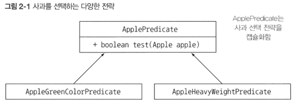
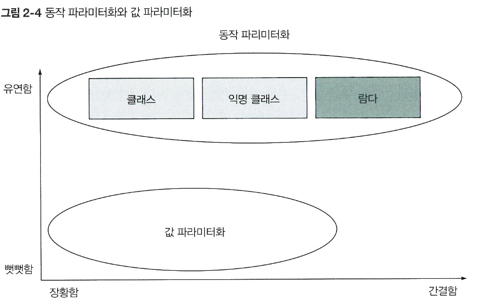

<aside>
💡 람다가 탄생한 배경과 자바8에서 광범위하게 사용된 소프트웨어 개발 패턴인 동작 파라미터화를 설명한다.
</aside>

> **이 장의 내용**
>
> - 변화하는 요구사항에 대응
> - 동작 파라미터화
> - 익명 클래스
> - 람다 표현식 미리보기
> - 실전예제: Comparator, Runnable, GUI

- **동작 파라미터화**(behavior parameterization)
  - 아직 어떻게 실행할 것인지 결정하지 않은 코드 블록
  - 자주 바뀌는 요구사항에 효과적으로 대응할 수 있다.
  - 코드 블록의 실행은 **나중**으로 미뤄진다.
- **람다 표현식**
    - 동작 파라미터화를 추가하려면 쓸데없는 코드가 늘어난다.<br>
      자바8은 람다 표현식으로 이 문제를 해결한다.

# 2.1 변화하는 요구사항에 대응하기
예제 코드를 점차 개선하며 설명

- 기존의 농장 재고목록 애플리케이션에<br>리스트에서 녹색 사과만 필터링하는 기능을 추가한다고 가정

## 2.1.2 색을 파라미터화

> 거의 비슷한 코드가 반복 존재한다면 그 코드를 추상화한다.
>

코드를 반복 사용하지 않고, 색을 파라미터화 할 수 있도록 **메서드에 파라미터를 추가**하면 변화하는 요구사항에 더 유연하게 대응할 수 있다!

- 결과 코드

    ``` java
    ... filterApplesByColor(List<Apple> inventory, Color color) { 
    	for (Apple apple: inventory) { 
    		if(apple.getColor().equals(color)){
    			...
    ```

    - **요구사항 변경** : 색 이외에도 무게로 구분 want!!

        ``` java
        ... filterApplesByWeight(List<Apple> inventory, int weight) { 
        	for (Apple apple: inventory) { 
        		if(apple.getWeight() > weight){
        			...
        ```

      → 색 필터링 코드와 대부분 중복!

      > ***DRY*** (Don’t Repeat Yourself) **원칙 위반**
      >
        - 색과 무게를 filter라는 메서드로 합치는 방법

          → 색이나 무게 중 어떤 것을 기준으로 필터링할지 가리키는 플래그 추가 (하지만, 절대 이 방법 사용 금지!)

## 2.1.3 가능한 모든 속성으로 필터링

- 모든 속성을 메서드 파라미터로 추가한 모습 (절대 금지!!)

    ``` java
    ... filterApples(List<Apple> inventory, Color color, int weight, boolean flag) { 
    	for (Apple apple: inventory) { 
    		if((flag && apple.getColor().equals(color))||
    			 (!flag && apple.getWeight() > weight)){ 
    			  ...
    ```

    - 대체 true와 false는 뭘 의미할까? 요구사항이 바뀌면 어쩔거?
    - filterApples에 **어떤 기준**으로 사과를 필터링할 것인지 **효과적으로 전달**할 수 있다면 더 좋을 것이다.
    <br>⇒ **동작 파라미터화**

# 2.2 동작 파라미터화

> **`전략 디자인 패턴`**(strategy design pattern) 적용.
> - 각 **알고리즘**(전략)을 캡슐화하는 **알고리즘 패밀리**를 정의해둔 후<br>
>    **런타임**에 알고리즘을 **선택**하는 기법

참 || 거짓 반환 함수를 뜻하는 **`Predicate`** 를 활용하여 **선택 조건을 결정하는 `interface`를** 정의

- 다음과 같이 여러 버전의 ApplePredicate를 정의할 수 있다.

  
    - ApplePredicate는 어떻게 다양한 동작을 수행할 수 있을까?
      ⇒ filterApples 에서 **ApplePredicate 객체**를 받도록 메서드 수정.

      ⇒ **동작 파라미터화!** 메서드가 다양한 전략을 받아서 내부적으로 다양한 동작 수행


## 2.2.1 추상적 조건으로 필터링

- **predicate 객체**로 사과 검사 조건 **`캡슐화`**

    ``` java
    ... filterApples(List<Apple> inventory, ApplePredicate p) { 
    	for (Apple apple: inventory) { 
    		if(p.test(apple)**){ // <- 
    			...
    ```

    - 원하는 조건에 따라 **ApplePredicate**를 적절하게 구현하는 **클래스**를 만들면 된다.
    - 하지만, 조건마다 클래스를 생성하는 것 또한 복잡해..

      ⇒ **람다!!**

[quiz2_1 동작 파라미터화 퀴즈](quiz/quiz2_1.java)

# 2.3 복잡한 과정 간소화

**람다**를 이용해서 여러 개의 ApplePredicate 클래스를 정의하지 않고도 조건식을 전달하는 방법

## 2.3.1 익명 클래스 anonymous class

> 클래스의 선언과 인스턴스화를 동시에 수행할 수 있는 기법.
>

- local class와 비슷한 개념.

- 사용 시. filterApples 메서드의 동작을 직접 파라미터화

    ``` java
    filterApples(inventory, new ApplePredicate() { 
    	public boolean test(Apple apple){
    		return RED.equals (apple. getColor());
    });
    ```


### 익명 클래스의 한계

1. 여전히 많은 공간을 차지
2. 많은 프로그래머가 익명 클래스의 사용에 익숙하지 않다.

   [quiz2-2 익명 클래스 문제](quiz/quiz2_2.md)

## 2.3.3 람다 표현식 사용

- 람다를 활용하여 위 예제를 간단하게 재구현.
    ``` java
    filterApples(inventory, (Apple apple) -> RED.equals (apple.getColor()));
    ```
  - 짱이다!!
  
- 지금까지 살펴본 내용 요약
  

## 2.3.4 형식 파라미터로 추상화
- 유연성 & 간결함
``` java
public interface Predicate<T> { 
	boolean test(T t);
}

public static <T> List<T> filter(List<T> list, Predicate<T> p) { 
	List<T> result = new Arraylist<>();
	for(T e: list) {
		if(p.test(e)) {
			result.add(e);
		}
	}
	return result;
}
```

## 2.4 실전 예제
> ### 동작 파라미터화 패턴
> 동작을 캡슐화한 후 메서드로 전달해서 메서드의 동작을 파라미터화함.
> - 자바 API의 많은 메서드를 다양한 동작으로 파라미터화할 수 있다.

## 2.4.1 Comparator로 정렬하기

- 컬렉션 정렬에 유연한 대응
- `java.util.Comparator` 객체 이용 - `sort`의 동작을 파라미터화

    ``` java
    public interface Comparator<T> {
    	int compare(T o1, T o2); 
    }
    ```

- 적용 예제

    ``` java
    // 익명 클래스
    inventory.sort(new Comparator<Apple〉() {
    	public int compare(Apple a1, Apple a2) {
    		return a1.getWeight().compareTo(a2.getWeight());
    	}
    });
    
    // 람다 표현식
    inventory.sort(
    	(Apple a1, Apple a2) -> a1.getWeight().compareTo(a2.getWeight()));
    ```


## 2.4.2 Runable로 코드 블록 실행하기

- 자바 스레드를 이용하면 병렬로 코드 블록을 실행할 수 있다.
- 여러 스레드가 각자 다른 코드를 실행할 수 있다.
- `java.lang.Runnable` 객체 이용 - `run`의 동작을 파라미터화

    ``` java
    // java.lang.Runnable
    public interface Runnable { 
    	void run();
    }
    ```

- 적용 예제

    ``` java
    // 익명 클래스	
    Thread t = new Thread(new Runnable() {
         public void run(){
             System.out.println("Hello World");
         }
    });
    
    // 람다 표현식
    Thread t = new Thread(() -> System.out.println("Hello World"));
    ```


## 2.4.3 Callable을 결과로 반환하기

- `Executorservice` - 태스크를 스레드 풀로 보내고 결과를 Future로 저장
    - `Callable` 인터페이스를 이용해 결과를 반환하는 태스크를 만든다.

        ``` java
        // java.util.concurrent.Callable 
        public interface Callable<V> {
        	V call();
        }
        ```

- 적용 예제

  실행 서비스에 태스크를 제출하여 활용.

    ``` java
    ExecutorService executorService = Executors.newCachedThreadPool(); 
    
    // 익명 클래스
    Future<String> threadName = executorService.submit(new Callable<String>() { 
    	@Overide
    	public String call() throws Exception {
    		return Thread, currentThread).getName);
    });
    
    // 람다 표현식
    Future<String> threadName = excutor.submit(
    		() -> Thread.currentThread().getName());
    ```


## 2.4.4 GUI 이벤트 처리하기

EventHandler의 setonAction 메서드의 동작 파라미터화.

``` java
button.setonAction((ActionEvent event)-> label.setText("~~");
```


