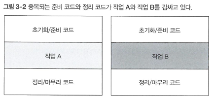
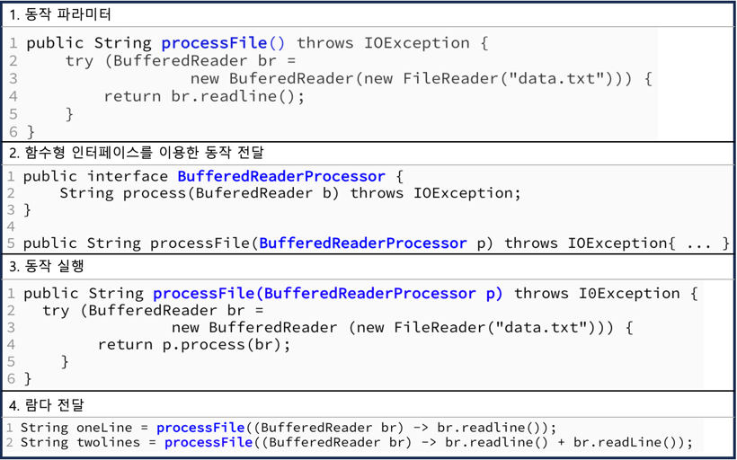
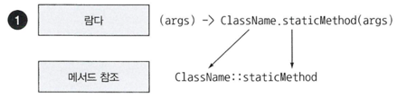
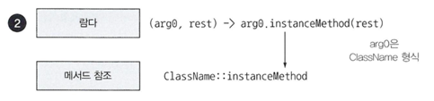

<aside>
💡 코드 예제와 퀴즈를 통해 람다 표현식과 메서드 참조를 완벽하게 이해할 수 있다.

</aside>

> **이장의 내용**
>
> - `람다`란 무엇인가?
> - 어디에, 어떻게 `람다`를 사용하는가?
> - 실행 어라운드 패턴
> - 함수형 인터페이스,형식 추론
> - 메서드 참조
> - `람다` 만들기

# 3.1 람다란 무엇인가?

> **람다 표현식**
>
>
> 메서드로 전달할 수 있는 익명 함수를 단순화한 것
>
> 이름은 없지만, 파라미터 리스트, 바디, 반환형식, 예외 리스트는 가질 수 있다.
>

### 람다의 특징

- **익명**
- **함수**<br>
  람다는 메서드처럼 특정 클래스에 종속되지 않으므로 함수라고 부른다.<br>
  하지만 메서드처럼 파라미터 리스트, 바디, 반환 형식, 가능한 예외 리스트를 포함한다.
    - ❓함수 vs 메서드<br>
      함수는 독립적인 기능인 반면 메서드는 객체 지향 프로그래밍에 속한다.<br>
      함수에서는 클래스를 선언할 필요가 없지만 메서드를 사용하려면 클래스를 선언해야 한다.<br>
      함수는 제공된 데이터로만 작동할 수 있지만 메서드는 주어진 클래스에서 제공된 모든 데이터에 액세스할 수 있다.

- **전달**

  람다 표현식을 메서드 인수로 전달하거나 변수로 저장할 수 있다.

- **간결성**

---

### 람다 표현식의 구성

- 파라미터, 화살표, 바디 세 부분으로 구성

  `(Apple a1, Apple a2)` -> `a1.getWeight().compareTo(a2.getWeight())`;

    - **파라미터 리스트**

      위 예시에선 Comparator의 compare 메서드 파라미터

    - **화살표(->)**

      람다의 파라미터 리스트와 바디를 구분

    - **람다 바디**

      람다의 반환값에 해당하는 표현식


---

- 람다 표현식 5가지 예제
    ``` java
    1. (String s) -> s.length();
    2. (Apple a) -> a.getWeight() > 150
    3. (int x, int y) -> {
    			sout("Result: ");
    			sout(x + y);
    		}
    4. () -> 42
    5. (Apple a1, Apple a2) -> a1.getWeight().compareTo(a2.getWeight());
    ```
- 람다 예제

    | 사용 사례 | 람다 예제                                                             |
    | --- |-------------------------------------------------------------------|
    | 불리언 표현식 | (List<String>list) -> list.isEmpty()                              |
    | 객체 생성 | () -> new Apple(10)                                               |
    | 객체에서 소비 | (Apple a) -> { sout(a.getWeight()); }                             |
    | 객체에서 선택/추출 | (String s) -> s.length()                                          |
    | 두 값을 조합 | (int a, int b) → a * b                                            |
    | 두 객체 비교 | (Apple a1, Apple a2) -> a1.getWeight().compareTo(a2.getWeight()); |


## 3.2.1 함수형 인터페이스

2장에서 다뤘던 `Predicate<T>` 예제!

- `함수형 인터페이스` : 정확히 하나의 추상메서드를 지정하는 인터페이스<br>
  ex) Predicate, Comparator, Runnable, Callable 등
    - `@FunctionalInterface`
      함수형 인터페이스 조건에 맞는지 검사하는 어노테이션

[Quiz 3-2 함수형 인터페이스](quiz03.md)

## 3.2.2 함수 디스크립터

람다 표현식의 시그니처를 **서술**하는 메서드. 말그대로 서술!
> > ex)  Runnable 인터페이스는 인수와 반환값이 없는 시그니처로 생각할 수 있다.
> >
> > : `() -> void`
> >
>
> > ex) `(Apple, Apple) -> int` : 2개의 Apple을 인수로 받아 int를 반환하는 함수
> >

> 함수형 인터페이스를 인수로 받는 메서드에만 람다 표현식을 사용할 수 있다.

[Quiz 3-3 어디에 람다를 사용할 수 있는가?](quiz03.md)


# 3.3 람다 활용 : execute around pattern

> 순환 패턴(recurrent pattern) : 자원을 열고, 처리한 후, 자원을 닫는 순서<br>
> 설정(setup)과 정리(cleanup) 과정은 대부분 유사<br>
> 즉, 실제 자원을 처리하는 코드를 설정과 정리 두 과정이 둘러싸는 형태를 갖는다.
> 

- 실행 어라운드 패턴을 적용하는 네 단계의 과정


# 3.4 함수형 인터페이스 사용

- 다양한 람다 표현식을 사용하려면 공통의 함수 디스크립터를 기술하는
  함수형 인터페이스 **`집합`** 필요
    - 이미 Comparable, Runnable, Callable 등 다양한 `FI` 제공
    - 자바 8 에서는 새로운 `FI` 제공
- **`Predicate<T>`**
    - 추상메서드 test 정의

      제네릭 형식 T 객체를 인수로 받아 boolean 반환

- **`Consumer<T>`**
    - 추상메서드 accept 정의

      제네릭 형식 T 객체를 인수로 받아 void 반환

    - 활용 예 : forEach 메서드 정의
- **`Function<T,R>`**
    - 추상메서드 apply 정의

      제네릭 형식 T 객체를 인수로 받아 제네릭 형식 R 객체 반환

    - 활용 예 : 입력을 출력으로 매핑하는 람다 정의

# 3.6 메서드 참조

> 기존의 메서드 정의를 재활용하여 람다처럼 전달
>

``` java
// 기존 코드
inventory.sort((Apple a1, Apple a2)->
		a1.getWeight().compareTo(a2.getWeight()));

// 메서드 참조
inventory.sort(comparing(Apple::getWeight);
```

## 3.6.1 요약

- 람다의 축약형

  메서드명 앞에 구분자(::)를 붙이는 방식


### 3가지 유형
1. 정적 메서드 참조   
   
2. 다양한 형식의 인스턴스 메서드 참조<br>
   `(String s) -> s.length()`   ⇒    `String::length`
   
3. 기존 객체의 인스턴스 메서드 참조
   `() -> apple.getWeight()`    ⇒     `apple::getWeight`
   

[Quiz 3-6 메서드 참조](quiz03.md)

