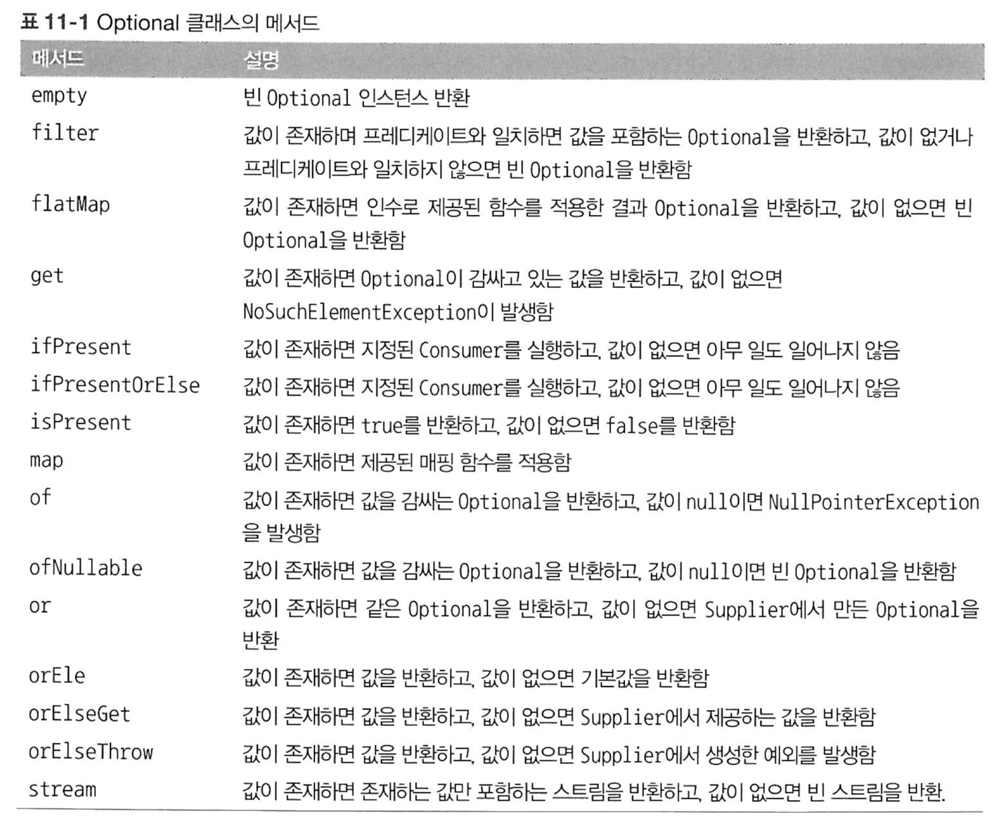

# 11장. null 대신 Optional 클래스
## 11-1. 값이 없는 상황을 어떻게 처리할까?

null을 사용 → NullPointException이 자주 발생

- 안전 내비게이션 연산자 `?.` → null에 대한 근원적인 문제를 해결할 수 없다.
- 스칼라, groovy : null 값을 감싸는 클래스 등장 (Option 등)

이에 영향을 받아 자바 8도 새로운 클래스 Optional 을 만듦

## 11-2. Optional 클래스 소개

:선택형 값을 캡슐화하는 클래스

값을 감싸는 클래스 (ex. `Optional<Car>`)

Optional의 장점 (쓰면 좋은점)

- 값이 없는 상황이 데이터에 문제가 있는 것인지, 아니면 알고리즘이 버그인지 명확하게 구분 가능하다

  = 선택형값인지 여부를 구별할 수 있다.


→ null 값이 절대 올 수 없는 변수에는 Optional 사용 X

null 값이 와도 되는 변수에는 Optional<클래스> 사용 O

## 11-3. Optional 적용 패턴

> **Optional의 메서드**
>

- null 이면 → `Optional.empty()`
- null이 절대 아니면 → `Optional.of({값})`
- null일수도 있는 값이면 → `Optional.ofNullable({값})`

map과 flatMap을 사용하면 null 값을 확인하느라 조건 분기문을 만들지 않아도 된다,.

### **`map`**

- map()을 통해서 Optional 내부에서 값을 꺼낼 수 있다

- Optional 객체를 최대 요소의 개수가 한 개 이하인 데이터 컬렉션이라고 생각하자 (요소의 수가 0~1개인 스트림)

→ Optional에 담긴 객체에서

리턴값이 Optional이 아닌 메서드를 실행할 때

map 사용

```java
Optional<Insurance> ins = Optional.ofNullable(insurancee)
Optional<String> name = ins.map(Insurance::getName)
```

### **`flatMap`**

flatMap()을 사용하면, 함수를 적용해서 생성된 모든 스트림이 하나의 스트림으로 병합되어 평준화된다.

→ Optional에 담긴 객체에서

리턴값이 Optional인 메서드를 실행할 때

flatMap 사용

(중첩 Optional을 제거하기 위해서!)


```java
    class Person{
        private Optional<Car> car;
        public Optional<Car> getCar(){
                return car;
        }
    }
    
    class Car{
        private Optional<Insurance> insurance;
        public Optional<Insurance> getInsurance(){
                return insurance;
        }
    }
    
    class Insurance{
        private String name;        // 모든 보험은 반드시 이름을 가지고 있으므로 Optional클래스를 사용하지 않음
        public String getName(){
                return name;
        }
    }
```

- `Person::getCar`

  문제 : `Optional<Optional<Car>>` 를 리턴한다. (**중첩 Optional**)

  해결책 : flatMap 연산으로 Optional을 평준화한다.

    - 평준화

      평준화 과정이란 이론적으로 두 Optional을 합치는 기능을 수행하면서, 둘 중 하나라도 null 이면 빈 Optional을 생성하는 연산이다.


- `Insurance::getName` 은 String을 반환하므로 중첩 Optional이 만들어지지 않는다.

  `Optional<Insurance>.map(Insurance::getName)` 을 수행하면 Optional<String>을 리턴한다.

  따라서 flatMap을 사용할 필요가 없다.


최종 값을 Optional에서 꺼내는 방법 : filter → map 을 순차적으로 이용하라`.orElse()`

- stream()
- get() : null이면 NoSuchElementException 발생

  Optional에 반드시 값이 있는게 아니면 쓰지 말 것

- orElse({기본값}) : 값이 없으면 **기본값**을 반환한다
- orElseGet(Supplier<T>) : orElse()의 게으른 버전

  값이 없을 때에만 Supplier를 실행하여 발생한 **값**을 반환한다

- orElseThrow(Supplier<T>) : 값이 없을 때에만 Supplier를 실행하여 발생한 **예외**를 반환한다
- ifPresent(Consumer<T>) : 값이 있을 때에만 인수로 넘겨준 동작을 실행할 수 있다.
- ifPresentOrElse(Consumer<T>, Runnable) : 값이 있을 때엔 Consumer를 실행, 값이 없을 때엔 Runnable을 실행할 수 있다.

