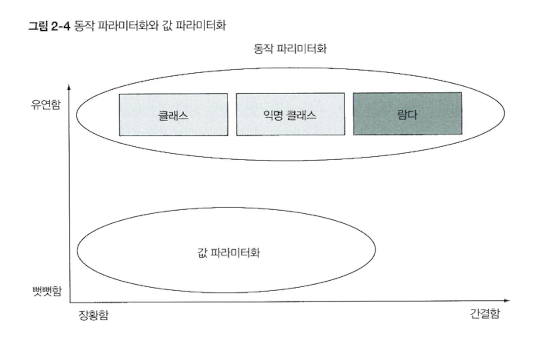

# 2. 동작 파라미터화 코드 전달하기

동작 파라미터화 (behavior parameterization) : 어떻게 실행할 것인지 아직 결정하지 않은 코드 블록

= 동작을 한 조각의 코드로 캡슐화한 다음에 메서드로 전달한다. (ex. 사과의 다양한 프레디케이트)

→ 메서드 내부적으로 다양한 동작을 수행할 수 있다.

→ 변화하는 요구사항에 더 잘 대응할 수 있다.

- 구현 방법
  1. 익명 클래스 (4번)
  2. 인터페이스를 구현하여 사용. 전략 패턴 (3번)
  3. 람다 표현식 (5번)

## 2-1. 변화하는 요구사항에 대응하기
[사과 필터 예제](https://github.com/StudyRecords/modern-java-in-action/blob/main/src/main/java/ch2/Apples.java)
0. 초록 사과만 필터링 하는 메서드 완성! → 갑자기 색깔과 무게 기준을 번갈아가며 필터링하라고 요구사항이 바뀜!!
   ```java
    List<Apple> filterGreenApples(List<Apple> inventory) {
        List<Apple> greenList = new ArrayList<>();
        for (Apple apple : inventory) {
            if (GREEN.equals(apple.getColor())) {
                greenList.add(apple);
            }
        }
        return greenList;
    } 
   ```
1. 비슷한 코드가 중복되면 그 코드를 **추상화**하라! = 파라미터 추가 (Color 변수, flag 변수 등등)

   → 파라미터를 추가하는 방법 만으로는 한계가 있다. (분류 기준이 더 추가된다면 사용 불가능)
   ```java
   List<Apple> filterGreenApples(List<Apple> inventory, Color color) {
       List<Apple> greenList = new ArrayList<>();
       for (Apple apple : inventory) {
           if (color.equals(apple.getColor())) {
               greenList.add(apple);
           }
       }
       return greenList;
   }  
   ```

2. 동작 파리미터화 사용 : 어떤 기준으로 사과를 필터링할 것인지 효과적으로 전달 가능


## 2-2. 동작 파라미터화
3. Predicate 인터페이스 정의 (전략 패턴)
   - 프레디케이트 : 인수로 값을 받아 true 나 false 를 반환하는 함수
   - 해당 인터페이스를 구현하는 HeavyPredicate, ColorPredicate 클래스 정의
   - **해당 인터페이스를 파라미터로 사용하는 메서드를 호출할 때에는 구현 클래스의 객체를 파라미터로 넘겨준다**
   - 메서드를 직접 전달하지 않고 객체로 감싸서 전달하는 방식
   - 장점 : 컬렉션 탐색 로직과 각 항목에 적용할 동작을 분리할 수 있다.
   - 단점 : 요구사항이 바뀔 때마다 클래스를 를 일일이 구현하고 인스턴스화 해야 하는 번거로움이 있다.

   ```java
    static List<Apple> filterApples(List<Apple> inventory, ApplePredicate pre) {
        List<Apple> apples = new ArrayList<>();
        for (Apple apple : inventory) {
            if (pre.filter(apple)) {
                apples.add(apple);
            }
        }
        return apples;
    }
   ```
   
   [퀴즈 2-1](https://github.com/StudyRecords/modern-java-in-action/blob/main/src/main/java/ch2/Quiz2_1.java)

## 2-3. 복잡한 과정 간소화
4. 익명 클래스
   - 클래스의 선언과 인스턴스화를 동시에 수행할 수 있는 기법
   - 즉석에서 필요한 구현을 만들어서 사용할 수 있다.
   - 단점 : 여전히 코드 중복이 발생 (메서드 선언부), 코드의 장황함 (한눈에 이해하기 어려운 코드, [퀴즈 2-2](https://github.com/StudyRecords/modern-java-in-action/blob/main/src/main/java/ch2/MeanginOfThis.java) )
   - 익명 클래스보다 동작 파라미터화를 더 권장한다.

   ```java
    // 3. 동작 파리미터화 할 때 사용한 filterApples 메서드 사용
   
   List<Apple> redApples  = filterApples(inventory, new ApplePredicate() {
      @Override
      public boolean filter(Apple apple) {
          return RED.equals(apple.getColor());
      }
   });
   ```   

5. 람다 표현식
   - 간결!
   
   ```java
   List<Apple> apples = filterApples(inventory, (Apple apple) -> RED.equals(apple.getColor()));
   ```

6. 리스트 형식으로 추상화
   - 형식 파라미터 `T`를 사용하여 사과가 아닌 다른 객체에도 필터 메서드를 사용할 수 있다.
   
   ```java
   public static <T> List<T> filterList(List<T> list, Predicate<T> pre){
        List<T> result = new ArrayList<>();
        for(T t:list){
            if(pre.test(t)){
                result.add(t);
            }
        }
        return result;
   }
   ```



## 2-4. 실전 예제
1. Comparator로 정렬하기
   - 다양한 기준으로 컬렉션 정렬하기 (기준 ex : 무게, 색 등)
   - `java.util.Comparator` 인터페이스를 구현한 클래스의 객체를 이용하여 `sort()`의 동작을 파라미터화할 수 있다.
   
   ```java
   inventory.sort(new Comparator<Apple>() {
        @Override
        public int compare(Apple a1, Apple a2) {
            return a1.getWeight().compareTo(a2.getWeight());
        }
   });
   
   inventory.sort((Apple a1, Apple a2) -> a1.getWeight().compareTo(a2.getWeight()));
   ```
   > Q. 위의 예제코드 중 `compareTo()` 메서드에 왜 오류가 날까?

2. Runnable로 코드 블록 실행하기
   - 스레드를 통해 병렬적으로 실행할 때 Runnable 인터페이스를 구현하여 여러 스레드에게 각자 다른 일을 줄 수 있다.
   - 단점 : 리턴 타입이 항상 void 여야 한다.
   ```java
   Thread t = new Thread(new Runnable() {
        @Override 
        public void run(){
            System.out.println("Hello World");
        }
   });
   
   Thread t = new Thread(() -> System.out.println("Hello World"));
   ```

3. Callable을 결과로 반환하기
   - ExcutorService 인터페이스
     - 태스크 제출가 실행 과정의 연관성을 끊어준다.
     - 태스크를 스레드 풀로 보내고 결과를 Future로 저장할 수 있다. (Runnable의 단점 보완)
     - Callable 인터페이스를 이요앟여 결과를 반환하는 태스크를 만든다.
   
   ```java
   import java.util.concurrent.Callable;    
   import java.util.concurrent.Executors;    
   
   ExecutorService excutor = Executors.newCachedThreadPool();
   Future<String> threadName = excutor.submit(new Callable<String>(){
        @Override
        public String call() throws Exception {
            return Thread.currentThread().getName();
        }    
   });
   
   Future<String> threadName = excutor.submit(() -> Thread.currentThread().getName());
   ```

4. GUI 이벤트 처리하기
   - 지정한 이벤트가 발생하면 이에 대응하는 동작을 수행한다.
   - setOnAction 메서드에 EventHandler 객체를 통해 동작을 전달한다.
   
