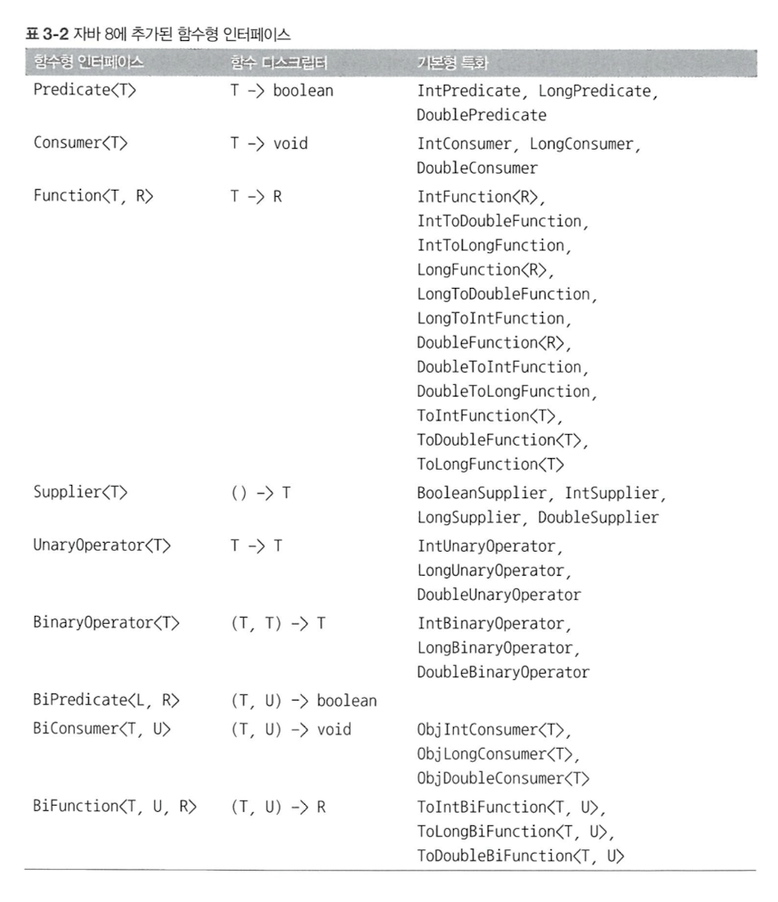
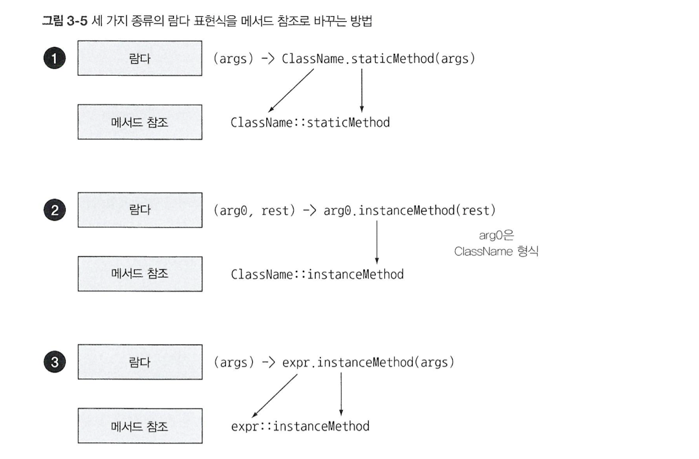

# 3. 람다 표현식

## 3-1. 람다란 무엇인가?


: 이름은 없지만 파라미터 리스트, 바디, 반환 형식을 갖는 함수

- 특징
  - **익명** : 이름 없는 함수
  - **함수** : 특정 클래스에 종속되지 않는다. static method
  - **전달** : 값처럼 사용 가능. 일급 시민. 인수를 통해 메서드로 전달할 수 있다. (익명 클래스와의 공통점)
  - **간결** : 익명 클래스보다 간결
  
- 스타일
  - 표현식 스타일 (expression style)
    ```
    (parameters) -> expression
    ```    

  - 블록 스타일 (block style)
    ```
    (parameters) -> { statement; }
    ```

<details>
  <summary> expression 🆚 statement </summary>

- expression (표현식, 수식)
    - 어떠한 값을 내포하고 있는 것. 값처럼 사용 가능한 것
    - ex. 수, 문자열, 산술 식, 함수의 리턴 값, 변수 등
  ```
  (parameters) -> expression
  
  (parameters) -> {return expression;}
  ```
- statement (구문, 상태)
    - 어떠한 작업을 수행하는 모든 문장
    - ex. 조건문, 반복문, 출력문, 변수 선언/할당 등
    - Java는 statement가 아니면 코드 블럭 안에서 단독으로 쓰일 수 없다.
    ```
    (parameters) -> { statement; }
    ```
    - 한 개의 void 메서드 호출은 중괄호로 감쌀 필요가 없다.
    ```java
    process(() -> System.out.println("Hello World"));
    ```

- ex. `age++;` 은 expression 이면서 동시에 statement 이다.

- [레퍼런스](https://gusdnd852.tistory.com/68)
</details>

## 3-2. 어디에, 어떻게 람다를 사용할까?
- Q. 어디에? 
  
  A. **함수형 인터페이스** 라는 문맥에서 사용!

  - 함수형 인터페이스가 올 수 있는 모든 자리는 람다로 대체가 가능하다
  - 조건 : (함수형 인터페이스의) 추상메서드의 시그니처와 일치하는 람다만 대체 가능하다!!!

### 함수형 인터페이스 (`@FunctionalInterface`)
- 오직 하나의 추상 메서드를 갖는 인터페이스

  (디폴트 메서드가 여러 개여도 추상 메서드만 하나이면 함수형 인터페이스다.)
- 함수형 인터페이스를 통해 메서드를 파라미터화할 수 있다.
- ex. `Comparator`, `Runnable`, `Callable`, `ActionListener` 인터페이스 등


- 람다 표현식으로 함수형 인터페이스의 추상 메서드 구현을 직접 전달할 수 있다. -> 전체 표현식을 함수형 인터페이스의 인스턴스로 취급할 수 있다. = 파라미터화할 수 있다. 

### 함수 디스크립터 (function descriptor)
- 람다 표현식의 시그니처를 서술하는 메서드
- 람다 표현식의 시그니처 == 함수형 인터페이스의 추상 메서드 시그니처
- 함수 디스크립터는 람다 표현식은 함수형 인터페이스의 추상 메서드와 같은 시그니처를 갖는다.

## 3-3. [람다 활용 : 실행 어라운드 패턴](https://github.com/StudyRecords/modern-java-in-action/blob/main/src/main/java/ch3/executeAroundPattern.java)
람다 만드는 방법 & 람다 사용 방법 알아보기

실행 어라운드 패턴 : 실제 자원을 처리하는 부분을 설정과 정리 두 과정이 둘러싸는 형식의 코드


1. 동작 파라미터화 적용 전 : 설정과 정리 과정이 반복된다.
2. 설정, 정리 과정은 재사용하고 작업을 수행하는 메서드만 다른 동작을 수행하도록 명령하자 = 동작 파라미터화!
   1. 함수형 인터페이스 정의 - `BufferedReaderProcessor`
      
      해당 인터페이스를 파라미터로 받는 `processFile()` 메서드 정의
   2. 해당 인터페이스를 구현한 클래스 생성 - `Processor`
   3. `processFile()` 메서드에 `Processor`의 객체를 인수로 전달
3. 람다 표현식 사용
   - 람다 표현식으로 함수형 인터페이스의 추상 메서드 구현을 직접 전달할 수 있다. (2-2번 과정 생략 가능)

## 3-4. 함수형 인터페이스 사용
`java.util.function` 패키지에 있는 다양한 함수형 인터페이스 알아보기
1. `Predicate <T>`
   - 추상 메서드 : `boolean test(T t);`
   - 함수 디스크립터 : T -> boolean
   - T 형식의 객체를 사용하는 불리언 표현식이 필요한 상황에서 사용
   
2. `Consumer <T>`
   - 추상 메서드 : `void accept(T t);`
   - 함수 디스크립터 : T -> void
   - T 형식의 객체를 인수로 받아서 어떤 동작을 수행하고 싶을 때 사용
   
3. `Function <T, R>`
   - 추상 메서드 : `R apply(T t);`
   - 함수 디스크립터 : T -> R
   - 입력을 출력으로 매핑하는 람다를 정의할 때 사용 (ex. Apple 객체에서 무게 정보 추출)

- 제네릭 파라미터에는 기본형(primitive type) 사용 불가능. 참조형(reference type)만 사용 가능하다.
 1. 오토 박싱 기능을 사용하자!
    - 박싱 : 기본형을 참조형으로 변환하는 기능
    - 언박싱 : 참조형을 기본형으로 변환하는 반대 동작 기능
    - 오토 박싱 : 박싱과 언박싱이 자동으로 이루어지는 기능
  
    단점 : 비용 소모 (박싱한 값은 힙에 저장된다 → 메모리 소비, 메모리 탐색 과정 필요)
  
  2. 기본형을 사용하는 특별한 함수형 인터페이스 사용하기
     - `IntPredicate` 인터페이스
        
       추상 메서드 : `boolean test(int t)` - 박싱 없음




## 3-5. 형식 검사, 형식 추론, 제약
컴파일러가 람다의 형식을 어떻게 확인하는지, 피해야 할 사항은 무엇인지

### 형식 검사
**대상형식으로 람다의 시그니처를 확인**
- 람다가 사용되는 문맥(context)을 보고 람다의 형식(type)을 추론할 수 있다.

  (할당문 콘텍스트, 메서드 호출 콘텍스트, 형변환 콘텍스트 등으로 람다 표현식의 형식을 추론할 수 있다.)
- 대상 형식(target type) : 어떤 문맥에서 기대되는 람다 표현식의 형식 (기대 형식). 람다의 표현식이 사용된 콘텍스트
> Q. 대상 형식과 함수 디스크립터의 차이점?
> (112p. 대상 형식을 이용해서 함수 디스크립터를 알 수 있다.)

- 람다 형식 검사 과정
  1. 람다 자리에 올 함수형 인터페이스 확인
  2. 해당 인터페이스의 추상 메서드 확인 (대상 형식 확인)
  3. 파라미터의 타입과 리턴 타입 확인 
- 동일한 람다 표현식을 함수 디스크립터가 일치하는 다른 함수형 인터페이스로 사용할 수 있다.

### 형식 추론
**람다의 시그니처로 함수형 인터페이스 추론**
- 대상 형식을 이용해서 함수 디스크립터를 알 수 있으므로 자바 컴파일러는 람다의 시그니처(파라미터 형식과 리턴 타입)를 추론할 수 있다.
    
  형식을 포함할지 배재할지는 가독성을 향상시키는 방식으로 그때그때 선택하기

### 제약
- 람다 표현식에서 사용할 수 있는 자유 변수
  - final로 선언되거나, final로 선언된 변수처럼 사용되는 **지역 변수**
  - **인스턴스 변수** (스레드가 공유하는 힙 영역에 존재하므로 제약X)
> Q. 지역변수, 자유변수의 관계, 차이점

## 3-6. 메서드 참조

### 기존의 구현된 메서드 재활용
- 메서드 참조를 이용하면 기존에 정의된 메서드를 재활용하여 람다처럼 전달, 사용할 수 있다.
- 실제 메서드를 호출하는 것은 아니므로 괄호는 필요 없다.

1. 정적 메서드 참조
   
    `Integer::parseInt`
2. 다양한 형식의 인스턴스 메서드 참조
   
    `String::length`
3. 기존 객체의 인스턴스 메서드 참조
   - 현존하는 외부 객체의 메서드를 호출할 때 사용된다.
    `expensiveTransaction::getValue`


> Q. 2번과 3번 유형의 메서드 참조를 어떤 상황에서 활용할 수 있는지 구분
> 2. 람다의 파라미터로 객체를 받는 경우 (현존하지 않는 객체)
> 3. 이미 객체를 할당받은 지역변수가 존재하는 경우 (파라미털로 전달받지 않는 경우)

### 생성자 참조
주로 사용하는 함수형 인터페이스
- `Supplier <T>` : void -> T
- `Function <T, R>` : T -> R
    
  ex. 사과 무게 (Integer) -> Apple
- `BiFunction <T, U, R>` : (T, U) -> R 
    
  ex. 사과 무게, 색깔 (Integer, Color) -> Apple 

## 3-7. [람다, 메서드 참조 활용하기](https://github.com/StudyRecords/modern-java-in-action/blob/main/src/main/java/ch3/Main.java)
ex. 사과 리스트 정렬
1. 코드 전달 (동작 파라미터화) - 전략 패턴 사용
   - sort 메서드에 정렬 전략을 전달하기 위해선 **동작 파라미터화**가 필요하다.
   - `void sort(Comparator<? super E> c)`
2. 익명 클래스 사용
3. 람다 표현식 사용
4. 메서드 참조 사용

→ 코드가 간결해짐 + 코드의 의미를 명확하게 전달할 수 있다.


## 3-8. 람다 표현식을 조합할 수 있는 유용한 메서드
- 여러 함수형 인터페이스는 유틸리티 메서드를 제공 (디폴트 메서드)

  → 여러 개의 람다 표현식을 조합해서 복잡한 람다 표현식을 만들 수 있다.

1. Comparator 조합
   - `Comparator.comparing()` : Function<T, R> → Comparator<T> 
   - `reversed()` : void → Comparator<T>
     
        역정렬에 사용
   - `thenComparing()` : Comparator<T> → Comparator<T>

     첫번째 기준이 같을 때 적용하는 두번째 기준
   ```
    inventory.sort(comparing(Apple::getWeight)
            .reversed()
            .thenComparing(Apple::getCountry));
    ```

2. Predicate 조합
   - `negate()`, `and()`, `or()` : void → Predicate<T>

3. Function 조합
   - `andThen()`, `compose()` : Function<T, R> → Function<T, R>
     
     Function을 적용시킨 결과에 다른 함수를 적용 (순서 지정)
   ```java
    // Function<T, R> 의 구현 객체 f, g
   
    f.andThen(g);        // f함수를 적용한 결과를 g 함수 적용 == g(f(x))
    f.compose(g);        // g함수를 적용한 결과를 f 함수에 적용 == f(g(x))
    ```
