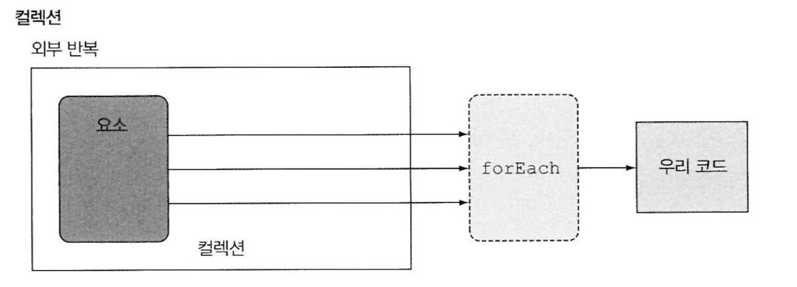
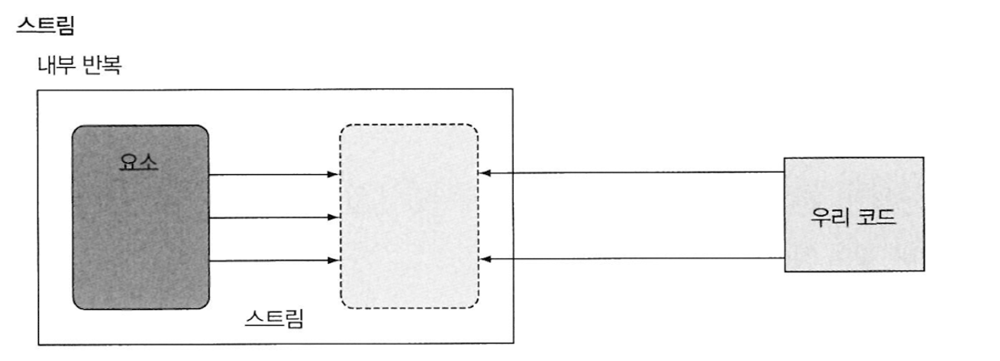

# 4. 스트림 소개
학습 목표 : 스트림의 개념, 스트림 🆚 컬렉션

## 4-1. 스트림(Streams)이란 무엇인가?

> **: 데이터 처리 연산을 지원하도록 소스에서 추출된 연속된 요소**
>
- 특징
    - 연속된 요소 : 특정 요소 형식으로 이루어진 연속된 값의 집합
    - 데이터 소스 : 컬렉션, 배열, I/O 자원 등의 소스로부터 데이터를 소비한다. 소스를 스트림으로 만들 때 요소의 순서는 유지된다.
    - 데이터 처리 연산 : 데이터 조작 연산을 수행한다.  (`filter`, `sort`, `map`, `find`, `match`, `reduce` 등)
    - 파이프라이닝 (pipelining) : 대부분의 스트림 연산은 스트림을 반환하므로 스트림 연산끼리 연결해서 커다란 파이프라인을 구성할 수 있다.
    - 내부 반복

- 컬렉션 데이터 반복을 멋지게 처리하는 기능
- 선언형으로 컬렉션 데이터를 처리 → 간결, 가독성⬆️
    <details>
    <summary> 선언형 🆚 명령형 프로그래밍 </summary>
    
  - 선언형 프로그래밍 : ~~방법(X)~~ **어떤 동작**을 수행할지 지정 (**WHAT**)
  - 명령형 프로그래밍 : for문이나 if 문 등을 사용하여 **어떻게** 동작을 구현할지 지정 (**HOW**)
    </details>

    
- 멀티스레드 코드 없이도 데이터를 병렬로 처리할 수 있음. → 성능⬆️

- streams 예제
    ```java
    Map<Dish.Type, List<Dish>> dishesByType = 
            menu.stream().collect(groupingBy(Dish::getType));
    ```

## 4-2. 스트림 시작하기

메서드

- `filter()`  필터링 : 람다를 인수로 받아 특정 요소를 스트림에서 제외시킨다.
- `map()` 추출 : 람다를 인수로 받아 한 요소를 **다른 요소로 변환** or **정보 추출**
- `limit()` 축소 : 스트림 크기를 정해진 개수 이하로 축소 (선착순)
- `collect()` : 스트림에 누적된 요소를 다른 형식으로 변환

## 4-3. 스트림과 컬렉션

공통점

- 연속된 요소 형식의 값을 저장하는 자료구조~~의 인터페이스를 제공~~

|  | 컬렉션                                                               | 스트림 |
| --- |-------------------------------------------------------------------| --- |
| 주제 | 데이터                                                               | 계산 |
| 주 기능 | 요소 저장 및 접근 연산                                                     | 표현 계산식 (filter, sorted, map 등) |
| 데이터 계산 시기 | - 현재 자료구조가 포함하는 모든 값을 메모리에 저장 <br/>- 컬렉션의 모든 요소는 컬렉션에 추가하기 전에 계산되어야 한다. | - 고정된 자료구조 (스트림에 요소를 추가하거나 제거할 수 없다)<br/>- 요청할 때만 요소를 계산 |
| 성격 | 생성자 중심 <br/>- 팔기도 전에 창고를 가득 채움 <br/>- 적극적 생성 : 모든 값을 계산할 때까지 기다림 | 요청 중심 제조, 즉석 제조 <br/>- 게으르게 만들어지는 컬렉션 <br/>- 게으른 생성 : 데이터를 요청할 때만 값을 계산 |
| 데이터 반복 처리 방법 | 외부 반복 | 내부 반복 |
| 예시 | DVD | 인터넷 스트리밍, 브라우저 인터넷 검색 |

- 스트림은 한번만 탐색/소비할 수 있다.

|  | 외부 반복 (컬렉션) | 내부 반복                                                                                          |
| --- | --- |------------------------------------------------------------------------------------------------|
| 어디에서 사용되는가 | 컬렉션 | 스트림                                                                                            |
| 주체 | 사용자가 직접 요소 반복 | 스트림이 알아서 반복을 처리하고 저장                                                                           |
| 병렬성 | 병렬성을 스스로 관리해야 한다. (ex. synchronized) | 병렬성 구현을 자동으로 선택한다.                                                                             |
| 기타 특징 | - 명시적으로 컬렉션 항목을 하나씩 가져와서 처리 | - 더 최적화된 다양한 순서로 데이터 처리 <br/>- 반복을 숨겨주는 연산 리스트가 미리 정의되어 있어야 한다. <br/>(ex. 람다 표현식을 인수로 받아서 동작 파라미터화) |




## 4-4. 스트림 연산

### 데이터 소스

- `stream()` 메서드를 사용하여 소스에서 스트림을 얻는다.

### 중간 연산 (intermediate operation)

- 서로 연결되어 파이프라인을 형성한다.
- 다른 **스트림을 반환**한다.
- 게으르다(lazy) → 최적화 효과

  **단말 연산이 파이프라인을 실행하기 전까지는 아무 연산도 수행하지 않는다.**

  중간 연산을 합친 다음에 최종 연산에서 한번에 처리한다.

- 중간 연산으로는 어떤 결과도 생성할 수 없다. (스트림의 요소를 소비하지 않는다.)
- ex. `filter()`, `distinct()`, `limit()`, `map()`, `sorted()` 등

### 최종 연산 (terminal operation)

- 스트림 파이프라인을 실행/처리한 다음 닫는다.
- 스트림 파이프라인에서 결과를 도출한다. (스트림의 요소를 소비해서 최종 결과를 도출한다.)
- **스트림이 아닌 다른 자료형을 반환**한다.

  `forEach()` 가 void를 반환하는게 신기하다.

- ex. `collect()`, `count()`, `forEach()` 등
