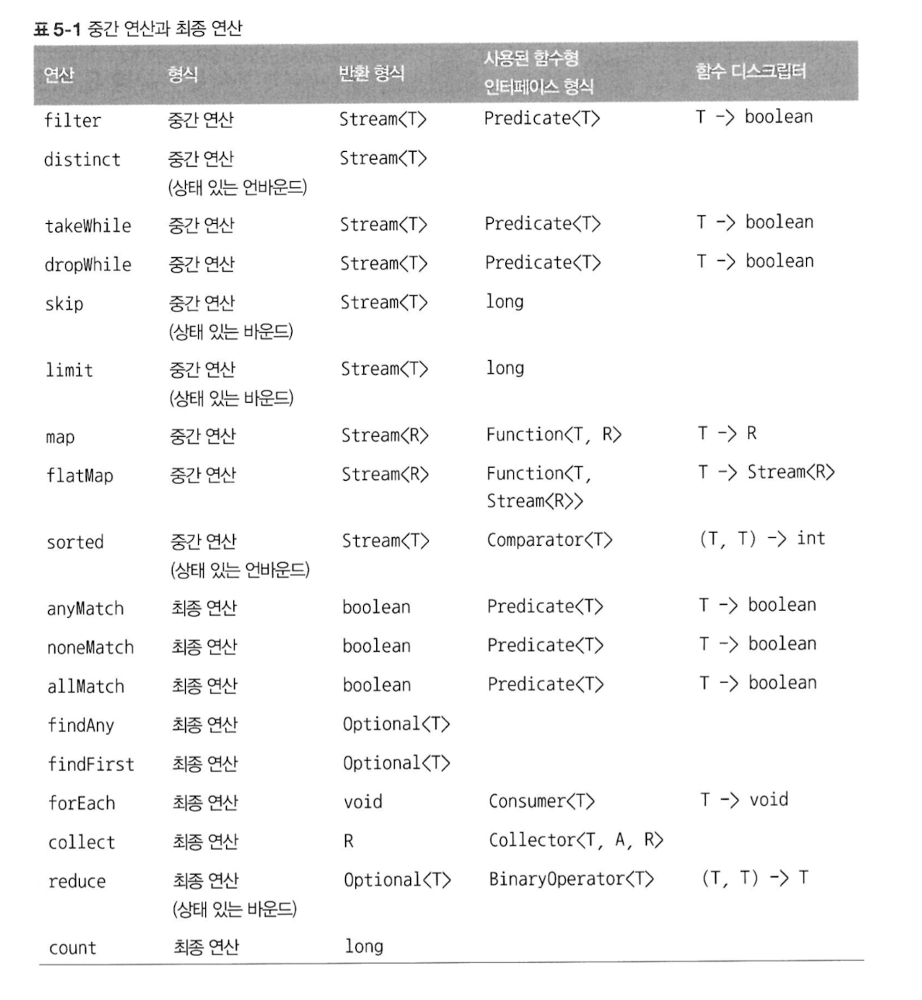

# 5. 스트림 활용
학습 목표

5-1 ~ 5-6 : 스트림 API가 지원하는 다양한 연산을 통한 데이터 처리,

5-7 : 다양한 소스로 스트림 만드는 방법

5-8 : 스트림의 특수한 경우 (무한 스트림)

## 5-1. 필터링

스트림 요소 선택하는 방법

- **`filter({프레디케이트})`** : 프레디케이트(불리언을 리턴하는 함수)를 인수로 받는다
- **`distinct()`** : 중복 필터링 (중복 요소 제거)

## 5-2. 스트림 슬라이싱

스트림 요소 선택 or 스킵하는 방법 (자바9) : 무한 스트림에서 사용 가능

- **`takeWhile({프레디케이트})`**
    - 프레디케이트가 참인 부분만 찾는다. (거짓인 부분은 버린다)
    - 모든 스트림에 프레디케이트를 적용해 스트림을 슬라이스함

  → 조건문의 경계가 되는 지점을 찾아서 슬라이싱한다.

    ```java
    List<Dish> lowMenu = menu.stream()
    		.takeWhile(dish -> dish.getCalories() < 300)
    		.collect(toList());
    ```


- **`dropWhile({프레디케이트})`**
    - 프레디케이트가 거짓인 부분만 찾아서 반환한다. (참인 부분은 버린다)
    - 거짓이 되는 지점에서 작업을 중단하고 남은 요소를 모두 반환한다.

    ```java
    List<Dish> highMenu = menu.stream()
    		.dropWhile(dish -> dish.getCalories() < 300)
    		.collect(toList());
    ```


→ **`takeWhile`**, **`dropWhile`** 은 소스가 정렬되어 있다는 사실을 알고 있을 때 사용!

- **`limit(n)`** : n 이하의 크기를 갖는 스트림을 반환한다. (선착순 마감, n만큼 차면 즉시 반환)
- **`skip(n)`** : 처음 n개의 요소를 제외한 스트림을 반환

## 5-3. 매핑

특정 데이터만 선택하는 작업 (스트림 요소 추출 or 변환)

- **`map({함수})`** : 스트림의 각 요소에 접근하여 함수를 적용

  → 함수를 적용한 결과가 새로운 요소로 매핑된다.

  기존의 스트림을 고치는게 아니라 새로운 스트림 버전을 만드는 것에 가깝다.

  - **`flatMap({함수})`** : 하나의 평면화된 스트림을 반환한다
      - 중복된 스트림을 1차원으로 평면화 시키는 메서드
      - 스트림의 각 값을 다른 스트림으로 만든 다음, 모든 스트림을 하나의 스트림으로 연결한다.

      ```java
      words = ["sunny", "Hi"]
    
      // 1 결과 : `List<String[]>` , [["s", "u", "n", "n", "y"], ["H", "i"]]
      words.stream()
          .map(word -> word.split(""))
          .distinct()
          .collect(toList());
    
      // 2 결과 : 여러개의 스트림이 생성됨 `List<Stream<String>>`
      words.stream()
          .map(word -> word.split(""))
          .map(Arrays::stream)     // 여러개의 문자열 배열을 각각 스트림으로 만든다
          .distinct()
          .collect(toList());
    
      // 3 결과 : 하나의 스트림이 생성됨 `List<String>`
      words.stream()
          .map(word -> word.split(""))
          .flatMap(Arrays::stream)    // 여러 개의 배열을 스트림이 아니라 스트림의 콘텐츠로 매핑한다
          .distinct()
          .collect(toList());
      ```

      ```java
      // flatMap 사용 O
      Stream<int[]> useFlatMap = IntStream.rangeClosed(1, 100).boxed()
              .flatMap(a -> IntStream.rangeClosed(a, 100)
                      .filter(b -> Math.sqrt(a * a + b * b) % 1 == 0)
                      .mapToObj(b -> new int[]{a, b, (int) Math.sqrt(a * a + b * b)})
              );
    
      // flatMap 사용 X
      Stream<Stream<int[]>> noFlatMap = IntStream.rangeClosed(1, 100).boxed()
              .map(a -> IntStream.rangeClosed(a, 100)
                      .filter(b -> Math.sqrt(a * a + b * b) % 1 == 0)
                      .mapToObj(b -> new int[]{a, b, (int) Math.sqrt(a * a + b * b)})
              );
      ```


## 5-4. 검색과 매칭

데이터 집합에 특정 속성이 있는지 여부를 검색

boolean 반환, 쇼트 서킷 (short-circuit, 모든 요소를 처리하지 않고도 결과 반환 가능, 결과를 찾는 즉시 반환)

- **`allMatch({프레디케이트})`** : 프레디케이트가 모든 요소와 일치 → True 반환
- **`anyMatch({프레디케이트})`** : 프레디케이트가 적어도 한 요소와 일치 → True 반환
- **`noneMatch({프레디케이트})`** : 프레디케이트가 모든 요소와 불일치 → True 반환

Optional<T> 반환 (null 방지용)

- **`findFirst()`** : 스트림에서 첫번째 요소 반환 (병렬 실행 불가)
- **`findAny()`** : 스트림에서 임의의 요소를 반환 (병렬 실행 가능)

## 5-5. 리듀싱

: 모든 스트림 요소 처리 → 값 도출

- **`reduce({초깃값}, {연산 종류})`**
- 스트림 요소들의 합, 곱, 최솟값, 최댓값 등을 구할 때 사용
1. 초깃값

   있으면 → 초깃값이 int면 동일한 데이터 타입의 값 리턴

   없으면 → Optional 리턴

2. 연산 종류

   **🚨🚨🚨 인수와 반환값의 타입이 일치해야 한다!!**

   `(a, b) → a+b` 처럼 **람다** 형태로 넘길 수도 있고

   `Integer::sum` 처럼 **메서드 참조** 방식으로 넘길 수도 있다. (더 선호)


를 파라미터로 넘겨야 한다.

### 🚨 스트림의 내부 상태

- map, filter : 내부 상태 없음 (무한 스트림 처리 가능)
- sorted, distinct : 내부 상태를 가짐 (무한 스트림 처리 불가능)
- reduce, sum, max : 내부 상태의 크기가 한정됨

++ 병렬 코드에서 발행자에 상태가 있으면 안전하지 않다.

- 196쪽 정리 추가

  filter, map 등은 상태를 저장하지 않는 상태 없는 연산이다.

  reduce 같은 연산은 값을 계산하는 데 필요한 상태를 저장한다.

  sorted, distinct 등의 메서드는 새로운 스트림을 반환하기에 앞서 스트림의 모든 요소를 버퍼에 저장해야 한다. 이런 메서드를 상태 있는 연산이라고 부른다.


**지금까지 내용 요약**



## 5-6. [실전 연습](https://github.com/StudyRecords/modern-java-in-action/blob/main/src/main/java/ch5/Main.java)

## 5-7. 숫자형 스트림
기본형 특화 스트림 (primitive stream specialization)

- int 요소에 특화된 IntStream
- double 요소에 특화된 DoubleStream
- long 요소에 특화된 LongStream

→ sum(), max(), min(), count(), average() 등 숫자 관련 리듀싱 연산 수행 메서드 제공

---

- 스트림 → 특화 스트림 : **`mapToInt()`**, **`mapToDouble()`**, **`mapToLong()`**

(`Stream<Integer>` 는 `IntStream`이 아니다!!)

```java
menu.stream()
    .mapToInt(Dish::getCalories);  // Stream<Integer> 가 아니라 IntStream 을 반환!!
```

- 특화 스트림 → 스트림 : **`boxed()`**, **`mapToObj()`**

  특화 스트림 IntStream을 일반 스트림 Stream<Integer>로 만들어준다


---

- 특화 스트림 용 Optional : OptionalInt, OptionalDouble, OptionalLong
- 특화 스트림 메서드
    - **`range({시작값}, {종료값})`** : 시작값과 종료값이 결과에 포함되지 X (초과, 미만)
    - **`rangeClosed({시작값}, {종료값})`** : 시작값과 종료값이 결과에 포함됨 (이상, 이하)

## 5-8. 스트림 만들기

1. **컬렉션**으로 스트림 만들기 : {컬렉션}.stream()
2. **범위 숫자**로 특화 스트림 만들기 : InputStream.range(1, 4)
3. **값**으로 스트림 만들기 : **`Stream.of({값1}, {값2}, {값3})`**
4. null이 될 수 있는 객체로 스트림 만들기 : **`Stream.ofNullable({null이 될 수 있는 객체})`**
5. **배열**로 스트림 만들기 : **`Arrays.stream({배열})`**
6. **파일**로 스트림 만들기 : **`Files.lines({파일 경로})`** - 파일의 행 스트림을 문자열로 반환
7. **함수**로 **무한 스트림** 만들기

   무한 스트림 (언바운드 스트림) : 크기가 고정되지 않은 스트림

   **`Stream.iterate({초깃값}, {연산 by 람다})`** : 기존 결과에 의존해서 순차적으로 연산 수행

   ex. Stream.iterate(0, n → n+2) : 0, 2, 4, 6, 8, 10, 12, 14, …

   **`Stream.iterate({초깃값}, {프레디케이트}, {연산 by 람다})`** : 프레디케이트가 false이면 스트림요소 생성을 중단

   **`Stream.generate(Supplier<T>)`** : **`iterate()`** 와 달리 생산된 각 값을 연속적으로 계산하지 않는다.

   **`Stream.generate(IntSupplier)`** 