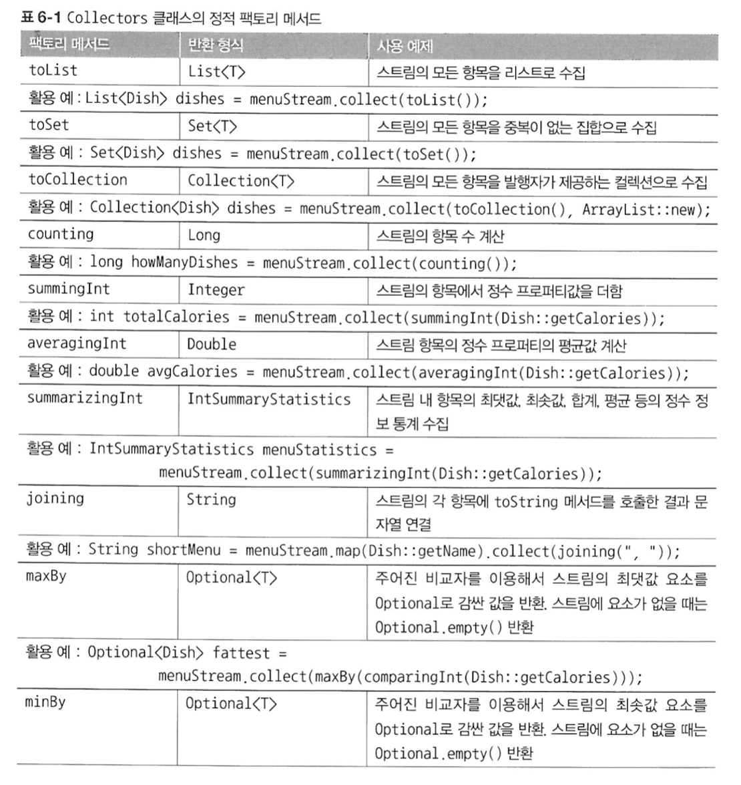
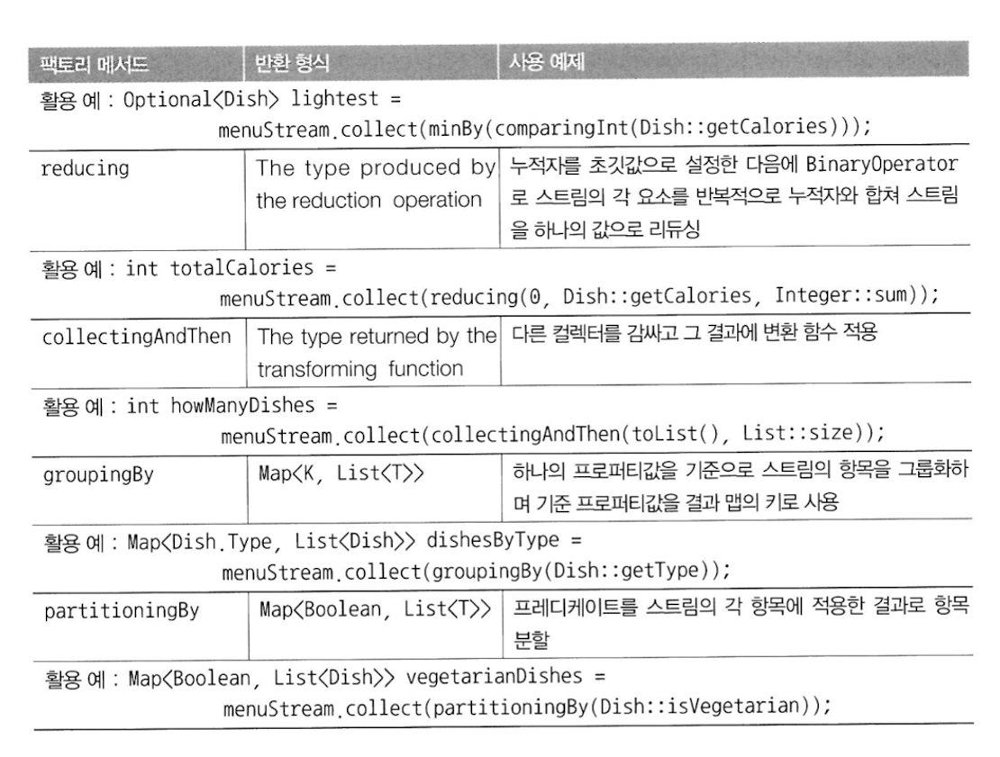

# 6장. 스트림으로 데이터 수집
학습 목표 : 스트림의 최종 연산 중 하나인 **`collect({Collector 인터페이스})`** 사용법 알아보기

→ Collectors 클래스의 정적 팩토리 메서드 종류 및 사용법

→ Collector 인터페이스의 구성 및 사용법

→ 커스텀 Collector 구현해보기

## 6-1. 컬렉터란 무엇인가?

Collector 인터페이스는 스트림의 요소를 어떤 식으로 도출할지 지정한다.

Collector로 스트림 항목을 컬렉션으로 재구성할 수 있다!

- collect() 에서 ~~리듀싱 연산을 이용해서~~ 스트림의 각 요소를 방문하여 Collector가 작업을 처리한다.

  데이터 저장 구조 변환에 많이 사용

- [Collectors 클래스의 정적 팩토리 메서드](https://docs.oracle.com/javase/8/docs/api/java/util/stream/Collectors.html) 의 기능 (크게 3가지로 분류)

  6-2. 스트림 요소를 하나의 값으로 리듀스하고 요약

  6-3. 요소 그룹화

  6-4. 요소 분할


## 6-2. 리듀싱과 요약

- **`counting()`** : 스트림 요소의 개수 반환

  `collect(Collectors.counting())` 보단 `count()` 를 더 많이 사용할 것 같음

- **`maxBy(Compartor<T>)`** : 스트림의 최댓값 찾기

  **`minBy(Compartor<T>)`** : 스트림의 최솟값 찾기

  `collect(Collectors.maxBy({내가 구현한 Comparator}))` 보단 `count()` 를 더 많이 사용할 것 같음


요약 연산 : (주로 리듀싱 기능을 사용하여) 스트림에 있는 객체의 숫자 필드의 합계나 평균 등을 반환하는 연산

- **`summingInt({객체를 int로 매핑하는 함수}**)**` : 요소들의 int의 총합

  **`summingLong({변환 함수})`**, **`summingDouble({변환 함수})`**

- **`summarizingInt({변환 함수})`** : IntSummaryStatistics 객체 반환

  **`summarizingLong({변환 함수})`**, **`summarizingDouble({변환 함수})`**

    ```java
    IntSummaryStatistics {
        count = 8, sum = 4000, min = 120, average = 500, max = 700 
    }
    ```


- **`joining()`** : 스트림 각 요소(객체)의 toString 메서드를 호출해서 추출한 모든 문자열을 하나의 문자열로 연결하여 반환 - 내부적으로 StringBuilder 사용

  **`joining("{구분 문자열}")`** 도 사용 가능


- **`reducing({초깃값}, {변환 함수}, {연산 종류})`**

  **`reducing({연산 종류})`**

  reduce()보다 collect(reducing())이 병렬성 측면에서 더 유리하다

  `{연산 종류}` : **🚨🚨🚨인수와 반환값의 타입이 일치해야 한다!! 🚨🚨🚨**


## 6-3. 그룹화
데이터 집합을 하나 이상의 특성으로 분류해서 그룹화하는 연산

- `**groupingBy(**{분류 함수}**)**` : 분류 함수를 기준으로 스트림이 그룹화된다.

  *`Function*<T, K>` = 분류함수 : 분류의 기준이 되는 **KEY**를 의미한다.

  `Collector` : 모이는 값들의 집합 / 값 (**VALUE**)

  → 분류 함수가 반환하는 키 - 각 키에 대응하는 스트림의 모든 항목 리스트 값

- `**groupingBy({분류 함수}, {컬렉터})**` 의 다양한 사용법

  → Map<Dish.Type, 컬렉터의 리턴값>

  1. `groupingBy(Dish::getType, **filtering(프레디케이트)**, ~~toList()~~)`
  2. `groupingBy({분류 함수 1}, **groupingBy({분류 함수 2}, {컬렉터})**)`

     다수준 그룹화 : 두 가지 이상의 기준을 동시에 적용하는 기능

  3. `groupingBy({분류 함수}, **counting()**)` → 데이터 수집, 리듀싱 작업
  4. 컬렉터 팩토리 메서드 `**collectingAndThen()**` 과도 함께 사용 가능
  5. **`mapping()`** → toSet 컬렉터로 전달된다. (중복X)

```java
// ex. MEAT 타입 메뉴들 중 500 칼로리가 넘는 음식이 없으면 MEAT키 자체가 담기지X
Map<Dish.Type, List<Dish>> dishes = menu.stream()
							.filter(dish -> dish.getCalories > 500)
							.collect(groupingBy(Dish::getType));

// ex. MEAT 타입 메뉴들 중 500 칼로리가 넘는 음식이 없어도 `MEAT=[]`로 표시된다.
Map<Dish.Type, List<Dish>> dishes = menu.stream()
							.collect(groupingBy(Dish::getType), 
												filtering(dish -> dish.getCalories() > 500, 
												toList())));
```


## 6-4. 분할


: 특수한 종류의 그룹화

결과로 반환하는 그룹화 맵은 최대 2개 (true, false) 의 그룹으로 분류된다.

- **`partitioningBy({분할 함수})`** : 프레디케이트의 참/거짓으로만 분류

  → Map<Boolean, List<Dish>> 리턴

- **`partitioningBy({분할 함수}, {컬렉터})`**

**6장 요약 : Collectors 클래스의 정적 팩토리 메서드**





## 6-5. Collector 인터페이스

컬렉터 인터페이스의 메서드

- **Collector 인터페이스**는 수집(collect)에 필요한 메서드를 정의해 놓은 인터페이스
- **Collectors 클래스**는 다양한 기능의 컬렉터(Collector 인터페이스를 구현한 클래스)를 제공

1. Collector 인터페이스는 어떻게 정의되어 있는가?

    ```java
    public interface Collector<T, A, R> {
        Supplier<A> supplier();
        BiConsumer<A, T> accumulator();
        BinaryOperator<A> combiner();
        Function<A, R> finisher();
        Set<Characteristics> characteristics();
    }
    ```
    T, A, R이 각각 무엇인지 설명

  - `Supplier<A> supplier()`
  - `BiConsumer<A, T> accumulator()`
  - `BinaryOperator<A> combiner()`
  - `Function<A, R> finisher()`
  - `Set<Characteristics> characteristics()`

2. Collector 인터페이스는 collect() 함수에서 어떻게 사용될까?

## 6-6. 커스텀 컬렉터를 구현해서 성능 개선하기