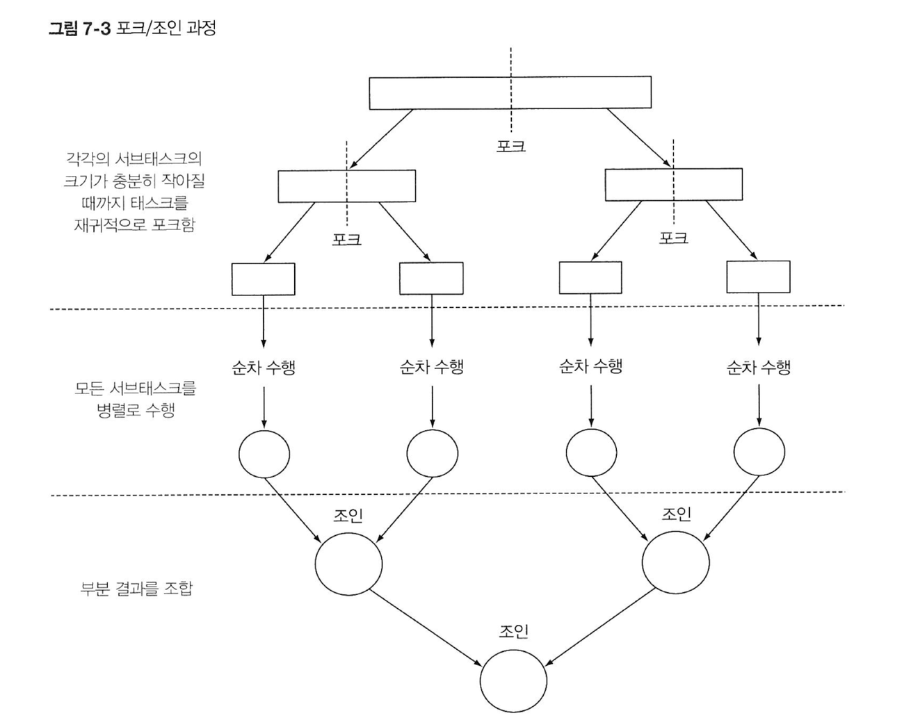
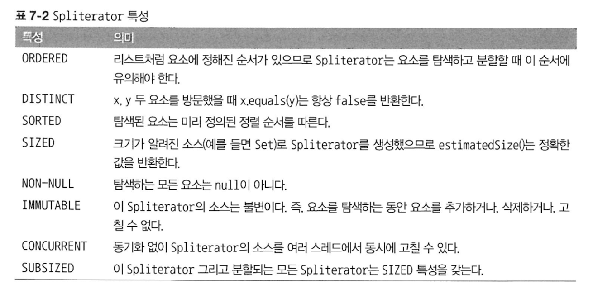

# 7장. 병렬 데이터 처리와 성능

## 7-1. 병렬 스트림

**병렬 스트림 동작 과정**

1. 할 일 청크  : 데이터를 서브파트로 분할
2. 각 스레드에 일을 부여 : 분할된 서브파트를 각 스레드에 할당
3. 레이스 컨디션이 발생하지 않도록 적절한 동기화를 추가해야 한다.
4. (각 스레드가 도출한) 부분 결과 합치기

- 병렬 스트림의 프로세서 수를 커스텀할 수 있으나, 기본값을 사용하는 것을 권장

**`.parallel()`** : 순차 스트림을 병렬 스트림으로 바꿔준다

**`.sequential()`** : 병렬 스트림을 순차 스트림으로 바꿔준다

→ 둘 중에 최종적으로 호출한 메서드가 스트림 파이프라인 전반에 영향을 미친다.

병렬 프로그래밍을 이해하지 못한 채로 사용하면 프로그램의 성능이 오히려 나빠질 수 있다.

- 병렬을 잘 이해하자 `parallel()` 내부적으로 어떤 일이 일어나는지
- 병렬 사용이 유리한 경우를 알아보자!

### 병렬 프로그래밍 주의점

1. 병렬화가 항상 좋은 건 아님!
    - 전체 파이프라인 연산 비용 = 요소 수 `N` * 하나의 요소를 처리하는 비용 `Q`

      `Q`⬆️ → 병렬 스트림 사용이 유리

    - 요소의 순서에 의존하는 연산 → 병렬이 불리
    - 소량의 데이터 → 병렬이 불리

2. 애매할 땐 항상 **측정** 후 판단해야 한다

   → JMH (벤치마크) 사용하여 측정하기

   JMH : JVM 위에서 동작하는 코드의 성능을 측정해주는 라이브러리 (Java Microbenchmark Harness)

3. 병렬화는 **공짜가 아니다**

   멀티코어 간 데이터 이동은 생각보다 비싸다 → 진짜 오래 걸리는 작업만 병렬화하자!

4. 공유하는 자원에 접근 시 **부작용**에 주의 : **공유된 가변 상태를 피해야 한다.**

   → 그렇다고 매번 동기화하면 병렬의 장점을 누릴 수 없다.

5. **박싱**을 주의하자

   자동 방식/언박싱은 성능을 크게 저하시킬 수 있는 요소이다.

   → 기본형 특화 스트림(ex. `IntStream`)을 사용하여 박싱 동작을 피하자.

6. 병렬에 유리한 **자료구조**를 사용하자

   굳굳 : ArrayList, IntStream.range

   굳 : HashSet, TreeSet

   밷 : LinkedList, Stream.iterate

7. **최종 연산** 병합 과정의 연산이 비싸면 병렬 스트림 비추

8. 병렬 스트림이 수행되는 내부 인프라구조도 고려하자 : **포크/조인 프레임워크**

## 7-2. 포크/조인 프레임워크

서브클래스 RecursiveTask<R> 를 구현해야 스레드풀을 이용할 수 있다.

compute() 추상메서드를 구현해야 한다.

```java
    public class A extends RecursiveTask<R> {
    
    @Override
    protected R compute(){
        if(태스크가 충분히 작거나 더 이상 분해할 수 없으면) {
            순차적으로 태스크 계산
        }
        else {
            태스크를 2개의 서브태스크로 분할
            재귀~~를 통해 분할과정 반복~~ (compute())
            모든 서브태스크의 연산이 완료될 때까지 기다리기 (join())
            각 서브태스크의 결과를 합치기
        }
    }
```



```java
    ForkJoinTask<R> task = new A();
    new ForkJoinPool().invoke(task);
```

→ 이 과정을 통해 스레드 풀을 사용할 수 있다.

A를 스레드 풀에 전달하면, `compute()` 메서드가 실행된다. (분할 후 정복 수행)

### 포크/조인 프레임워크 제대로 사용하는 법

- `join()` 메서드는 두 서브태스크가 모두 시작된 다음에 호출해야 한다.
- RecursiceTask 내에서는 ForkJoinPool의 `invoke()` 메서드를 사용하지 않아야 한다.
  대신 `compute()` or `fork()` 를 호출!
- 두 개의 서브태스크로 분리 후, 둘 다 `fork()`-`fork()` 보단 `fork()`-`compute()` 호출이 더 효율적이다!
- 포크/조인 프레임워크에선 디버깅이 어려움. 주의
- 포크 시간 < 각 서브태스크 수행시간

  태스크를 여러 독립적인 태스크로 분할할 수 있어야

  병렬화가 효율적이다. 이 경우가 아니면 순차 버전이 더 좋다.


### 태스크를 어느 정도로 분할해야 가장 효율적일까?

→ 코어 개수와 상관없이 작게 분할할 수록 좋다!

- Why?

작업 훔치기 기법에서는 모든 스레드에 태스크를 거의 공정하게 분할한다.

스레드들은 자신의 큐 헤드에서 태스크를 가져와서 처리한다.

but 모든 스레드의 처리 속도는 다를 수 있다.

이 때, 할 일이 없어진 스레드는 쉬지 않고 다른 스레드의 큐의 꼬리에서 작업을 훔쳐온다. (큐가 완전히 빌 때까지)

→ 작업 훔치기 기법으로 스레드 간의 작업부하를 비슷한 수준으로 유지하기 위해선 **태스크가 작을수록** 👍🏻


## 7-3. Spliterator 인터페이스
스트림을 자동 분할하는 기법

```java
    public interface Spliterator<T> {
        boolean tryAdvance(Consumer<? super T> action);    // 탐색할 요소 남아있으면 -> true 반환
        Spliterator<T> trySplit();                         // 자신을 분할하여 두번째 Spliterator 생성
        long estimateSize();                               // 요소 수 반환
        int characteristics();                             // 추상메서드 (뒤에서 자세히 설명)
    } 
```

- **`characteristics()`** : `Spliterator` 의 특성을 포함하는 int를 반환한다.



- [커스텀 Spliterator](https://github.com/StudyRecords/modern-java-in-action/tree/main/src/main/java/ch7) : 사용자가 직접 태스크 분할 기준을 제시

  ex. `WordCounterSpliterator` : 스페이스를 기준으로 문자열을 분할하기 위해서 커스텀한 Spliterator